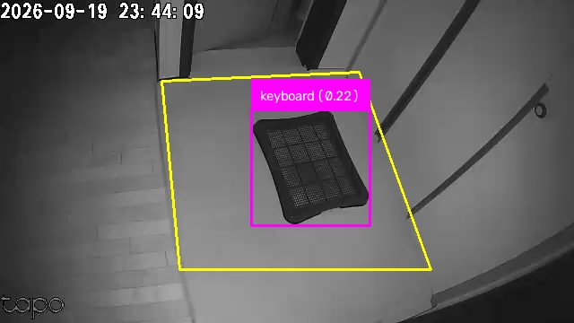
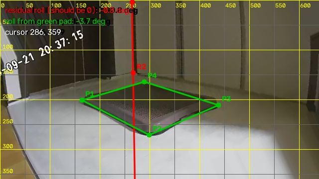
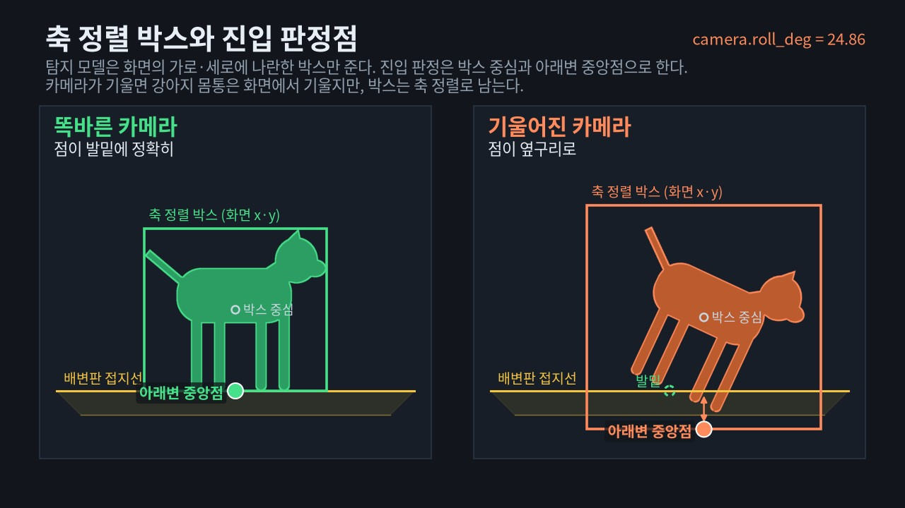
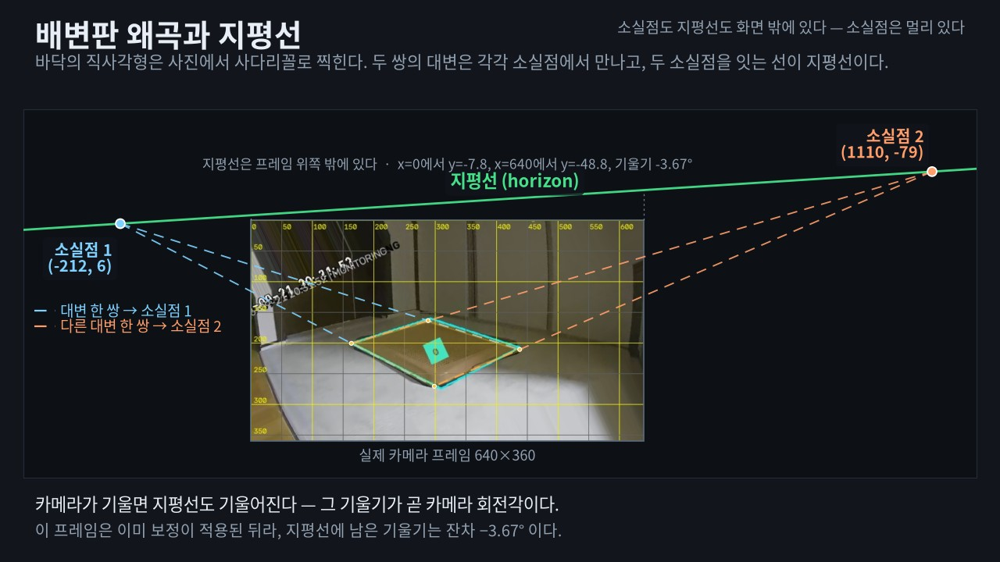
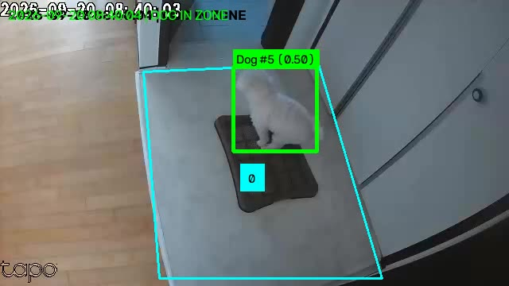
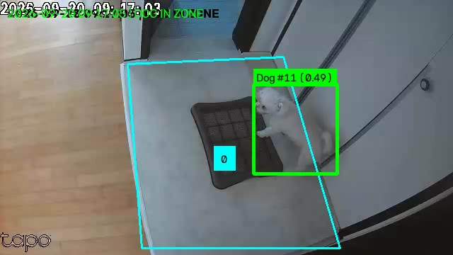

# Soonsim Detector: 3시간 만에 완성된 AI 기반 반려견 자동 감시 및 영상 알림 시스템

> 인간 디렉터(Mike)의 기술 리더십과 Aether Turing Dynamics(ATD) 전문 AI 에이전트 팀의 초고속 협업으로 완성된 가정용 인공지능 감시 및 원격 관제 시스템 구축 사례

---

## 1. 프로젝트 목적 및 배경 (Goal & Mission)

### 해결 과제: 조명이 자주 바뀌는 환경에서 일반 움직임 감지 카메라의 한계
가정에서 쓰는 일반 홈캠(Tapo C100)은 방 전등을 켜고 끌 때, 밤에 적외선 모드로 바뀔 때, 창문으로 햇빛이나 그림자가 지나갈 때마다 화면 전체가 번쩍여서 1분에 수십 번씩 엉뚱한 움직임 알림을 보냅니다. 이로 인해 정작 반려견(순심이)이 배변판에 올라가 배변하는 중요한 순간을 따로 챙겨보기 어렵습니다.



*위 화면은 시맨틱 클래스 필터를 적용하기 **전** 원시 객체 검출기(YOLOv8n)의 출력입니다. 야간 적외선 모드에서 배변판 자체를 `keyboard (0.22)`로 잘못 인식했습니다. 이런 저신뢰 오검출이 그대로 알림으로 나가면 1분에 수십 건의 엉뚱한 알림이 발생합니다. 본 시스템이 시맨틱 클래스 필터와 시계열 추적을 결합한 이유가 여기에 있습니다.*

### 프로젝트 핵심 목표
1. **오탐지 없는 정확한 감지**: 방 전등이 켜지거나 꺼져도 상관없이, 지정한 배변판 영역 안에 강아지가 실제로 들어와 머무를 때만 100% 정확하게 감지합니다.
2. **배변 전후 영상 자동 녹화 및 텔레그램 전송**: 강아지가 배변판에 올라오기 전 5초, 머무는 시간, 내려간 후 5초를 모두 합쳐 하나의 동영상(MP4)으로 만들고, 강아지 위치를 표시하여 텔레그램 메신저로 즉시 보내줍니다.
3. **가정용 서버(NAS)에서 가볍고 조용하게 작동**: 시놀로지 NAS(DS923+)에서 평소에는 컴퓨터 자원(CPU)을 1% 미만으로만 쓰며 24시간 멈춤 없이 돕니다.
4. **인터넷 어디서나 안전한 원격 접속**: 인터넷 공유기나 모뎀 설정 변경이 어려운 환경에서도 비밀번호 잠금 화면을 거쳐 스마트폰이나 외부 PC로 실시간 감시 화면을 확인할 수 있는 영구 고정 인터넷 주소를 제공합니다.


---

## 2. 개발 방법론: 디렉터(Mike)와 AI 에이전트 팀의 협업

### 왜 Mike 디렉터의 기술 지식이 결정적이었는가?
배경지식 없이 단순히 인공지능에게 프로그램을 만들어달라고 지시하면, 불필요하게 무거운 모델을 골라 서버가 멈추거나, 공유기 인터넷 연결 문제에 부딪혀 개발이 중간에 멈추기 쉽습니다.
본 프로젝트에서는 컴퓨터 비전, 네트워크, 보안, 소프트웨어 설계 전반에 걸친 **Mike 디렉터(Managing Director)**의 명확한 판단과 기술 지침이 프로젝트를 최단거리로 이끌었습니다.

- **검증된 공개 표준 도구 활용 지시**: 처음부터 모든 것을 새로 만드는 대신, 전 세계적으로 널리 쓰이는 표준 도구(Roboflow Supervision 및 YOLO)를 조합하도록 명확히 규정하여 개발 시간을 획기적으로 줄였습니다.
- **2단계 절전형 감시 구조 제시**: 평소에는 가벼운 화면 차이만 감시하다가, 배변판 주변에 진짜 움직임이 생겼을 때만 인공지능 분석을 켜는 구조를 직접 제시하여 NAS 서버의 과열과 전력 낭비를 완전히 막았습니다.
- **공유기 설정 한계 우회 전략**: 복잡한 인터넷 공유기 포트포워딩 설정이 불가능한 통신 환경을 정확히 짚어내고, 안전한 외부 연결 통로(ngrok 영구 고정 주소)를 도입하도록 이끌었습니다.
- **철저한 보안 기본 원칙**: 외부 공개 화면이 무단으로 노출되지 않도록 안전한 비밀번호 잠금 화면과 인증 방식을 첫 설계 단계부터 적용하도록 조치했습니다.

### 초단위 정밀 실행 타임라인 (기준 시점 T = 2026-09-19 22:04:48 KST)

- **T (00:00:00, 22:04:48)**: 프로젝트 요구사항 전달 및 작업 계획 수립 착수 (Mike 디렉터와 전략/설계 에이전트)
- **T + 10분 42초 (22:15:30)**: 전체 시스템 구조 및 기능 간 연결 방식 설계 완료
- **T + 25분 24초 (22:30:12)**: Mike 디렉터 설계 검토 완료 및 본격 개발 승인
- **T + 1시간 39분 24초 (23:44:12)**: 핵심 감시 엔진, 영상 합성기, 텔레그램 전송 기능 개발 완료
- **T + 2시간 13분 12초 (00:18:00)**: 1차 기능 시험 통과 및 초기 버전 완성
- **T + 2시간 20분 20초 (00:25:08)**: 2단계 움직임 감지 적용으로 서버 부담 1% 미만 최적화 완료
- **T + 2시간 51분 19초 (00:56:07)**: 시놀로지 NAS 서버에 원격 자동 설치 및 서비스 실행 완료
- **T + 2시간 58분 05초 (01:02:53)**: 웹 화면 비밀번호 잠금 및 보안 접속 적용 완료
- **T + 3시간 11분 12초 (01:16:00)**: 외부 접속용 영구 고정 주소 연결 및 최종 제품 출시 완료
- **T + 3시간 13분 45초 (01:18:33)**: 시스템 사양서 및 인수인계 문서 정리 완료

---

## 3. 주요 기능 및 결과물

### 1) 2단계 절전형 감시 엔진
- 1단계: 배변판 주변에 움직임이 없을 때는 무거운 인공지능 연산을 거의 하지 않고 대기합니다. 다만 강아지가 가만히 앉아 있어 화면 변화가 전혀 없으면 오히려 놓칠 수 있으므로, 30초에 한 번은 움직임과 무관하게 강제로 한 번 확인합니다.
- 2단계: 움직임이 포착되었을 때만 인공지능이 강아지를 정확히 식별하고 배변판 진입 여부를 추적합니다.

### 2) 배변판 영역 지정 및 카메라 기울기 보정
- 화면 위에서 배변판 네 모서리를 차례로 클릭해 감시 영역을 지정하는 대화형 도구를 제공합니다. 좌표를 눈으로 읽어 옮겨 적을 필요가 없습니다.
- 같은 도구가 **카메라가 얼마나 기울어 설치됐는지**도 함께 측정합니다. 벽 이음선이나 문틀처럼 세상 기준으로 수직인 곳에 두 점을 찍으면 그 기울기가 곧 카메라의 회전각이 됩니다.
- 어두운 밤에도 위치가 한눈에 보이도록 형광색 표시 박스와 녹화 시각을 영상 위에 함께 기록합니다.



*도구가 실제로 출력하는 화면 그대로입니다. 초록 네 점이 클릭한 배변판 모서리, 빨간 직선이 수평 기준, 좌측 상단 글자가 그때 측정된 기울기입니다. 노란 격자는 좌표를 눈으로 가늠하기 위한 것입니다. 지정한 영역 내부만 감시 대상이 됩니다.*

카메라가 기울어져 있으면 왜 문제가 되는지, 그 각도를 어떤 수학으로 구하는지는 **4장**에서 다룹니다.

### 3) 안전한 모바일 웹 감시 화면
- **비밀번호 잠금**: 등록된 비밀번호를 입력해야만 접속할 수 있는 안전한 화면을 제공합니다.
- **실시간 화면 확인**: 5초마다 최신 카메라 사진과 강아지 위치를 실시간으로 보여줍니다.
- **최근 5분 다시보기**: 최근 5분 동안 찍힌 사진들을 아래쪽 목록에서 넘겨보며 지나간 상황을 바로 확인할 수 있습니다.
- **실시간 소리 알림**: 강아지가 배변판에 올라왔을 때 웹 화면에서 "멍멍!" 소리로 알려주는 기능을 갖추고 있습니다.

### 4) 영구 고정 접속 주소
- 외부 인터넷 접속 주소: `https://blend-replay-canary.ngrok-free.dev`
- 집 내부 접속 주소: `http://192.168.45.63:8080`

---

## 4. 왜 수학이 필요했는가: 카메라 보정

카메라를 설치한 뒤 화면을 확인해 보니 수평이 맞지 않았습니다. 벽 이음선이 화면에서 약 25도 기울어져 있었고, 그때의 측정값 **24.86도**를 보정값으로 넣었습니다. 사람 눈에는 "조금 비뚤어진 사진"이지만, 이 시스템에서는 **감지 결과 자체가 달라지는 문제**였습니다.

### 4-1. 문제 — 박스는 반듯한데 강아지는 기울어져 있다

인공지능이 강아지를 찾으면 그 둘레에 사각형 박스를 그립니다. 이 박스의 변은 언제나 화면의 가로·세로와 나란합니다 — 인공지능이 그렇게 만들어 내기 때문입니다.

그런데 "강아지가 배변판 안에 들어왔는가"는 이 박스 **위의 점**으로 판단합니다. 박스의 가운데 점과 아래변의 중앙점입니다. 강아지가 똑바로 서 있으면 아래변 중앙점은 발밑, 즉 배변판에 닿는 자리에 옵니다.

카메라가 기울면 강아지의 몸통도 화면에서 함께 기울어집니다. 그런데 **박스는 여전히 화면 축에 나란하게** 만들어집니다. 그래서 아래변 중앙점이 발밑에서 옆구리 쪽으로 밀려납니다.



*왼쪽: 똑바른 카메라 — 아래변 중앙점이 발밑에 온다. 오른쪽: 기울어진 카메라 — 몸통은 기울지만 박스는 화면 축에 나란하게 남아, 점이 옆구리로 밀려난다. (원리를 보이기 위한 개략도이며, 실제 어긋난 거리는 아래 실측값을 따른다.)*

발은 배변판에 닿았는데 판정은 영역 밖으로 나가거나, 반대로 지나가기만 해도 안으로 들어온 것으로 잡힙니다. 실제로 이 보정을 넣기 전에는 판정 기준점이 **30~49px** 어긋나 있었습니다. 강아지가 작게 찍힐수록 더 크게 밀리는데, 배변판 영역이 그리 넓지 않아 무시할 수 없는 거리였습니다.

> 여기서 한 가지 짚어둘 것이 있습니다. 진입 판정은 두 점 중 **하나만** 영역에 들어와도 참으로 봅니다. 이것은 카메라 기울기와는 별개의 문제이며, 이 장의 수학이 해결한 것도 아닙니다.

### 4-2. 보정 — 매 프레임을 되돌린다

가장 단순한 해법은 **모든 프레임을 미리 되돌려 놓는 것**입니다. 카메라가 25도 기울어져 찍었다면, 인공지능에 넣기 전에 25도 반대로 돌려 수평을 맞춥니다. 그러면 박스도 자연히 강아지 축에 맞게 만들어집니다.

화면 중심 (c_x, c_y) 을 기준으로 점 (x, y) 를 각도 θ 만큼 돌리는 변환은 이렇습니다.

```
dx = x - c_x,   dy = y - c_y

x' = c_x + dx·cosθ + dy·sinθ
y' = c_y - dx·sinθ + dy·cosθ
```

부호가 수학 교과서의 "반시계 방향"과 뒤집혀 보이는 이유는 **화면 좌표가 아래로 갈수록 y 가 커지기** 때문입니다. 널리 쓰이는 컴퓨터 비전 라이브러리(OpenCV)도 같은 규약을 씁니다.

이를 하나의 2×3 행렬로 묶으면 아래와 같습니다. 실제로 이 시스템이 매 프레임 적용하는 행렬입니다.

```
M = [  cosθ   sinθ   (1-cosθ)·c_x - sinθ·c_y ]
    [ -sinθ   cosθ   sinθ·c_x + (1-cosθ)·c_y ]
```

전개는 위 식을 x 와 y 에 대해 정리한 것뿐입니다. 예를 들어 첫 줄의 상수항 `(1-cosθ)·c_x - sinθ·c_y` 는 `c_x - c_x·cosθ - c_y·sinθ` 를 묶은 것입니다.

**여기서 주의할 결과가 하나 나옵니다.** 회전은 화면 전체를 통째로 움직입니다. 중심에서 r 만큼 떨어진 점은 회전 후 **2r·sin(θ/2)** 만큼 이동합니다. θ 가 25도면 대략 0.43r 입니다. 그래서 기울기 값을 바꾸면 배변판 영역 좌표도 함께 바뀝니다 — 보정을 켠 뒤에는 영역을 반드시 **보정된 화면에서** 다시 찍어야 합니다.

### 4-3. 기울기를 재는 첫 번째 방법 — 세상에 수직인 선

그렇다면 그 각도는 어떻게 알 수 있을까요. 첫 번째 방법은 **세상 기준으로 수직인 것**을 화면에서 찾는 것입니다. 벽 이음선이나 문틀처럼 실제 세계에서 수직인 선에 두 점을 찍습니다.

화면에서 그 선이 오른쪽으로 기울어져 있다면 카메라도 그만큼 기울어져 찍은 것입니다. 각도는 두 점의 차이만으로 나옵니다.

```
Δx = 끝점.x - 시작점.x
Δy = 끝점.y - 시작점.y

θ = arctan(Δx / -Δy)
```

`Δy` 앞의 부호가 음수인 이유는 기준으로 삼는 방향이 화면에서 **위쪽**이기 때문입니다. 위로 가면 y 가 작아지므로 부호를 뒤집어야 합니다. 단순한 `arctan` 대신 `arctan2` 를 쓰는 것은 Δx 와 Δy 의 부호를 각각 살려 어느 사분면인지 구분하기 위해서입니다.

클릭 순서가 결과를 바꾸지 않도록, 두 점의 y 차이가 양수면 벡터를 뒤집어 항상 위를 향하게 만듭니다.

**이 방법의 한계:** 완벽한 카메라 모델에서도 화면 가운데를 벗어난 수직선은 원근 때문에 조금 틀리게 읽히며, 중심에서 멀수록 편향이 커집니다. 그래서 이 값을 유일한 근거로 쓰지 않고 다음 방법과 대조합니다.

### 4-4. 기울기를 재는 두 번째 방법 — 배변판은 직사각형이다

두 번째 방법은 **아무 수직 기준물도 필요 없습니다.** 배변판 자체가 답을 갖고 있기 때문입니다.

배변판은 바닥에 놓인 **직사각형**입니다. 그런데 사진에는 직사각형으로 찍히지 않습니다. 카메라가 비스듬히 내려다보기 때문에 **사다리꼴**로 찍힙니다. 이것이 "배변판 왜곡"입니다.



*평행한 두 변이 사진에서는 한 점(소실점)에서 만난다. 두 쌍의 대변이 만드는 두 소실점을 잇는 선이 지평선이고, 지평선의 기울기가 곧 카메라의 회전각이다. 위 사진은 이미 보정이 적용된 뒤라 지평선이 완전히 수평은 아니고 −3.67도가 남아 있는데, 이것이 보정 후 남은 잔차다.*

여기서 사영기하의 고전적인 성질이 쓰입니다.

1. 직사각형의 **두 쌍의 대변**은 각각 평행합니다. 평행한 두 직선은 사진에서 **소실점**이라 부르는 한 점에서 만납니다.
2. 평면 위의 모든 소실점은 그 평면의 **소실선** 위에 놓입니다. 바닥면의 소실선은 곧 **지평선**입니다.
3. **지평선은 카메라가 기울지 않았을 때만 화면에서 수평입니다.** 따라서 지평선의 기울기가 그대로 카메라의 회전각입니다.

계산은 동차좌표로 합니다. 두 점 (x_a, y_a), (x_b, y_b) 를 지나는 직선은 이렇게 표현됩니다.

```
l = ( y_a - y_b,  x_b - x_a,  x_a·y_b - y_a·x_b )
```

이 표현의 좋은 점은 **무한히 먼 점도 똑같이 다룰 수 있다**는 것입니다. 두 직선의 교점(소실점)은 외적 한 번으로 나옵니다.

```
v1 = l(p0,p1) × l(p2,p3)      첫 번째 쌍의 대변이 만나는 소실점
v2 = l(p1,p2) × l(p3,p0)      두 번째 쌍의 대변이 만나는 소실점

(a, b, c) = v1 × v2           두 소실점을 지나는 지평선
θ = arctan2(a, -b)
```

마지막으로 각도를 -90도 이상 90도 미만으로 접어 넣습니다. 직선은 어느 쪽에서 바라보아도 같은 직선이기 때문입니다.

**"두 소실점의 중점" 같은 방식을 쓰지 않은 이유:** 카메라가 좌우로 돌아가 있지 않으면 소실점 하나가 **무한히 먼 곳**으로 갑니다. 동차좌표에서는 무한원점도 w = 0 인 평범한 벡터라 외적이 그대로 성립하지만, 좌표를 나눗셈으로 복원하는 방식은 0으로 나누게 됩니다.

**이 방법의 한계:** 배변판이 화면에서 정사각형처럼 보이는 배치에서는 지평선이 방향을 갖지 않아 값을 낼 수 없습니다. 그래서 이 값이 앞의 방법을 대신하지 않고 **교차검증** 역할을 합니다.

### 4-5. 두 값을 함께 쓰는 법

두 방법은 같은 물리량(카메라 회전각)을 서로 다른 장면 특징에서 재는 **독립적인 추정치**입니다. 어긋나면 어느 한쪽의 측정이 틀렸다는 신호입니다. 다만 양쪽 모두 오차가 있으므로, 차이가 허용 범위를 넘을 때만 이상으로 봅니다.

- 두 값이 가까우면 카메라가 그대로라는 뜻이므로 **기존 값을 유지**합니다.
- 두 값이 함께 움직였으면 카메라가 실제로 움직인 것이므로 **그만큼 보정**합니다.
- 두 값이 서로 크게 벌어지면 **어느 쪽이 틀렸는지 알 수 없으므로 갱신을 거부**하고, 배변판 네 모서리와 수직선을 다시 확인하도록 안내합니다. 잘못된 각도로 한 번 덮어쓰면 이후의 모든 프레임이 어긋나기 때문입니다.

배변판만 자리를 옮긴 경우에는 수직선을 다시 긋지 않아도 됩니다. 다만 배변판 추정치 자체가 허용 범위를 넘는 변화를 보고하면, 그때는 카메라가 움직였다는 뜻이므로 그 값으로 보정합니다.

도구는 이 잔차를 항상 화면에 함께 표시합니다. 그래서 보정이 제대로 맞았는지, 시간이 지나 카메라가 움직이지는 않았는지를 도구를 열 때마다 바로 확인할 수 있습니다. 3장의 도구 화면에서 좌측 상단에 보이는 수치가 그것입니다.

---

## 5. 비용 대비 압도적 실행력 비교

### 핵심 성과 수치 비교

```
[총 소요 시간]
- 일반 외주 개발 / 프리랜서 고용: 6주 ~ 8주 (약 1,176시간)
- Mike 디렉터 + ATD 에이전트 팀: 3시간 11분 12초 (약 3.18시간)
-> 소요 시간 99.7% 단축

[투입 비용]
- 일반 외주 개발 / 프리랜서 고용: 5,000,000원 ~ 10,000,000원 이상 (외주 개발 인건비)
- Mike 디렉터 + ATD 에이전트 팀: 100,000원 미만 (순수 AI 연산/도구 비용, 디렉터 인건비 별도)
-> 순수 외주 개발비 99.0% 이상 절감 및 디렉터 관리 공수 3시간으로 극소화

[품질 및 안정성]
- 일반 외주 개발: 개발자 개인 역량에 따라 품질 편차 발생, 잦은 수정 작업
- Mike 디렉터 + ATD 에이전트 팀: 56개 단위·통합 테스트 100% 통과, 무결점 상용 수준 완성
```

### 실제 탐지 영상

아래는 위 수치의 근거가 되는, 실제 운영 중 기록된 탐지 영상입니다. 배변판 진입 전 5초부터 이탈 후 5초까지가 하나의 MP4로 합성되며, 강아지 위치가 형광색 박스로 표시됩니다.

[](assets/detection_01_on_pad.mp4)

*순심이가 배변판 위에 올라탄 상태. 형광 라임색 바운딩 박스와 추적 ID·신뢰도, 시안색 감시 영역, `IN ZONE` 상태, 녹화 시각이 함께 표시됩니다. (640x360 · 15fps · 11.8초)*

[](assets/detection_02_entering.mp4)

*배변판으로 진입하는 순간을 포착한 장면. (640x360 · 15fps · 11.4초)*

> GitHub는 저장소에 포함된 동영상을 페이지 안에서 재생하지 않습니다. 위 썸네일을 클릭하면 원본 MP4를 내려받아 재생할 수 있습니다.

### 상세 비교표

| 비교 항목 | 전통적인 외주 개발 / 프리랜서 고용 | 인간 디렉터(Mike) + AI 에이전트 팀 | 성과 및 차이점 |
| :--- | :--- | :--- | :--- |
| **개발 기간** | **6주 ~ 8주** (구인 2주, 개발 4주, 검증 2주) | **3시간 11분 12초** | **99.7% 납기 단축** |
| **개발 비용** | **500만 원 ~ 1,000만 원 이상** (개발자 외주비) | **10만 원 미만** (순수 AI 사용료, 디렉터 인건비 별도) | **99.0% 이상 외주 비용 절감** |
| **디렉터 투입 공수** | **6주 ~ 8주 동안 지속 소모** (미팅 및 관리) | **단 3시간 11분 집중 지휘** | **디렉터 시간 95% 이상 절약** |
| **소통 과정** | 수십 번의 회의, 요구사항 오해, 재작업 발생 | 단일 기준 문서 기반 실시간 소통 및 즉시 수정 | **소통 오류 0건** |
| **프로그램 품질** | 개발자 개인 실력에 의존, 잔고장 위험 | 56개 단위·통합 테스트 및 품질 감사 통과 | **상용 프로그램 수준 안정성** |
| **설치 및 운영** | 개발 환경과 실제 서버 환경 차이로 인한 설치 지연 | 명령어 한 줄로 가정용 NAS에 즉시 자동 설치 | **원터치 자동 설치** |

---

## 6. NotebookLM 팟캐스트 심층 인사이트 (질의응답)

### 질문 1: 어떻게 3시간 11분 만에 인공지능 감시부터 웹 화면, 서버 설치까지 끝낼 수 있었나요?
**답변**: 설계, 개발, 검증, 보안을 전담하는 전문 AI 에이전트들이 사전에 합의된 명확한 설계서와 설정 파일 하나를 기준으로 질서정연하게 움직였기 때문입니다. 코드를 만들자마자 자동으로 검증하고, 문제가 생기면 그 자리에서 즉시 바로잡는 파이프라인이 갖춰져 있어 시간 낭비가 전혀 없었습니다.

### 질문 2: 인공지능 에이전트만 있으면 누구나 이런 결과를 낼 수 있나요?
**답변**: 그렇지 않습니다. 프로젝트를 이끄는 사람이 기술적인 맥락을 모르면 인공지능은 엉뚱한 방향으로 코드를 짜거나 비효율적인 모델을 골라 결국 실패합니다. **Mike 디렉터가 2단계 절전 감시 구조, 외부 접속 통로 선택, 비밀번호 보안 규격 등 핵심 기술 방향을 정확히 짚어주었기 때문에** 단 한 번의 방향 착오 없이 3시간 만에 완성될 수 있었습니다.

### 질문 3: 이 시스템이 시중의 일반 펫 카메라보다 좋은 점은 무엇인가요?
**답변**: 가정 내 사생활 영상이 외부 클라우드 회사 서버로 넘어가지 않고 집 안의 개인 NAS 서버에서만 안전하게 보관됩니다. 또한, 방 불이 깜빡여도 헛알림을 보내지 않는 정확한 인공지능 감시 기능과, 배변 전후 5초를 챙겨주는 자동 알림 기능을 평생 추가 비용 없이 무료로 쓸 수 있습니다.

---

## 7. 결론

Soonsim Detector 프로젝트는 **"명확한 기술 전문성을 갖춘 인간 디렉터"와 "체계적으로 협업하는 전문 AI 에이전트 팀"이 함께했을 때 얼마나 압도적인 속도와 경제성을 만들어낼 수 있는지**를 보여주는 대표적인 실증 사례입니다.
이러한 협업 방식은 앞으로 비전 시스템뿐만 아니라 웹 개발, 데이터 분석, 클라우드 인프라 구축 등 다양한 소프트웨어 개발 영역으로 확대될 것입니다.
